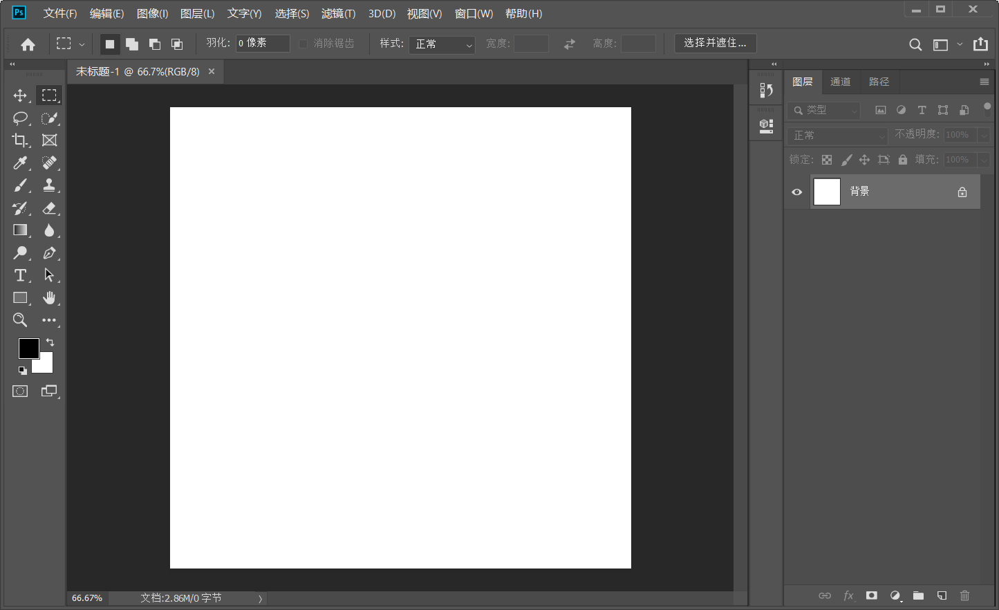

2020.12.04

PS老师：草堂   ？？？

美国Adobe公司开发  中文：奥多比

**PS：位图的处理软件**

位图：图片缩小拉大之后图像会失真、色彩表现力好，文件大

PS的使用方向：摄影后期、效果图的后期处理、图像合成、电影海报、电商、网页设计、UI设计、等等...很多方面，较为广泛

版本: ps cc 2019

#### 打开软件页面

**按Esc键**  进入新页面

#### **修改右侧面板，复位到原始状态**

#### **改动面板**

鼠标拖出  点击×

添加

在窗口里可以找到所有的面板

常用的为三个

#### **打开/新建画布**

Ctrl + n  是新建

①分辨率：打印时用300分辨率；显示时用72分辨率（数值越大图像越清晰）

②颜色模式：显示时用RGB   RGB代表红绿蓝

​       				打印时用CMYK  CMYK代表青、品红、黄、黑

RPG目前只能显示10位  8位完全满足要求

首选项/设置   Ctrl + k  或者在编辑-首选项-常规

新建画布

**然后显示**

Ctrl + o  打开资源管理器  选取图片新建

再打开一个新的画布

#### **置入操作**

将图片拖入已有的画布中去

有定界框    还未置入

点击对勾   或者回车   成功置入

或者在文件中置入

#### **保存操作**

在文件中

存储为 PS格式（PSD)   保留了图层可以以后再编辑

#### **快捷键整理**

| 新建画布：ctrl+n                    | 打开：ctrl+o         |
| ----------------------------------- | -------------------- |
| 保存：ctrl+s                        | 另存为：ctrl+shift+s |
| 存储为web所用格式：ctrl+shift+alt+s |                      |