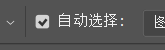

2020.12.05

调整画布

调整素材

初识**图层**   

初识画笔

### 调整画布

缩放画布：Alt + 滚动滑轮     或者是    Ctrl + +-号  或者使用工具

拖动画布

空格 + 鼠标拖动

让画布指定大小 

**Ctrl + 1** 100% 显示    显示实际大小

**Ctrl + 0** 全屏显示    铺满显示

### 调整素材

移动画布中元素

先拖动元素再按住shift 可以进行平移操作

Ctrl 开关自动选择

在自动选择模式下，按住Alt键进行移动复制

调出定界框  

Ctrl + t    调整元素的相对大小，位置，旋转

进入**自由变换模式**

然后按住shift    可以单独调整宽和高

按住 Ctrl 拖动点  可以变形

按住Alt 以中心点进行调整

也可以在属性栏进行设置

撤回    Ctrl + z  

反撤回  Ctrl + shift + z

### 初识**图层**   

图层面板

右下角操作栏

选中图层

Alt + delete   取前景色

Ctrl + delete 取背景色

### 初识画笔

画笔默认使用前景色

左右中括号   [ ] 调整画笔粗细

shift + 左右中括号  []   调整画笔边缘软硬

ctrl + alt + i  调出图像属性

